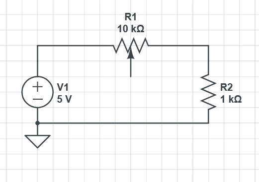

## Proposal
- Use basys3
- Sequential + combinational logic
- SPI controller to interface with MAX3008 ADC chip on breadboard
- Make the SPI FSM by HAND
- Pass in value, store it in register?
- Get value, and output to BCD display as voltage
- Have a custom symbol for voltage? (Use a bcd slot)

## Analog Circuit Testing Design
- Arduino to output voltage
- Potentiometer to adjust voltage levels using voltage divider

## Digital System Design
- SPI FSM
- Voltmeter Module
### SPI FSM
- 
-
-

### Voltmeter FSM
-
-
- 

## Extra: Ammeter (If time permits)
- Exact same FSM for voltmeter, but redirect to analog circuit for the ammeter
